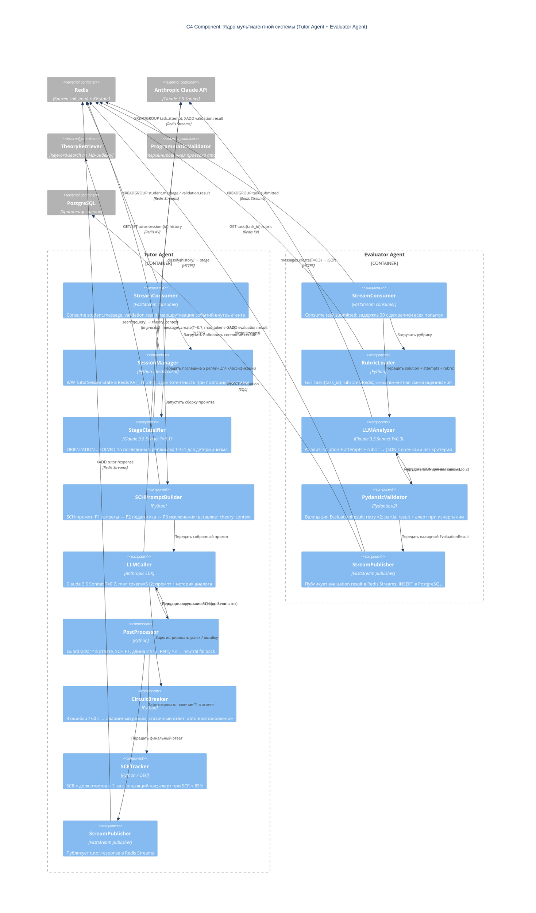

# C4 Component — Внутреннее устройство ядра системы

Диаграмма раскрывает компоненты внутри **Tutor Agent** и **Evaluator Agent** — ядра мультиагентной системы. Именно здесь сосредоточена вся LLM-логика, SCH-иерархия, retrieval-контур и механизмы защиты.

## Ключевые компоненты и их роли

### Tutor Agent

| Компонент | Роль |
|---|---|
| **StreamConsumer** | Точка входа; маршрутизирует события; обеспечивает idempotency через проверку уже обработанных event ID |
| **SessionManager** | Единственный компонент, работающий с Redis KV; хранит всё сессионное состояние |
| **StageClassifier** | LLM-вызов с T=0.1; диагностирует педагогический этап студента для адаптации промпта |
| **SCHPromptBuilder** | Сборщик системного промпта; жёсткая иерархия P1 > P2 > P3 не может быть изменена на ходу |
| **LLMCaller** | Изолированный компонент; единственный, кто вызывает Anthropic API в рамках тьютора |
| **PostProcessor** | Детерминированные guardrails: проверка SCH, вопросительный знак, длина; retry / fallback |
| **CircuitBreaker** | Защита от каскадного сбоя при недоступности Anthropic API |
| **SCRTracker** | Метрика качества тьютора: SCR < 85% → алерт в Grafana |

### Evaluator Agent

| Компонент | Роль |
|---|---|
| **StreamConsumer** | Задержка 30 с после получения task.submitted для завершения записи всех попыток |
| **RubricLoader** | Загружает 5-компонентную рубрику из Redis; изолирован от истории тьютора |
| **LLMAnalyzer** | Анализирует технику атаки; структурированный JSON-вывод |
| **PydanticValidator** | Детерминированный контракт вывода; retry при невалидном JSON; partial result при исчерпании |
| **StreamPublisher** | Гарантирует запись в PostgreSQL перед ACK события в Redis Streams |
