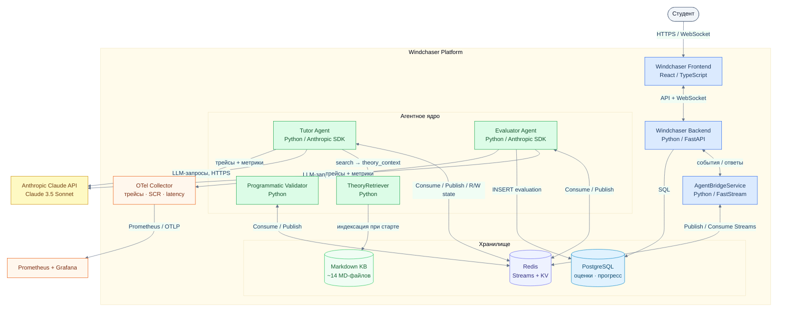

# C4 Container — Frontend, Backend, Orchestrator, Retriever, Tool Layer, Storage, Observability

Диаграмма раскрывает внутреннее устройство мультиагентной системы: контейнеры, их технологии и способы взаимодействия.

## Пояснения к контейнерам

| Контейнер | Технология | Роль |
|---|---|---|
| **Windchaser Frontend** | React / TypeScript | UI: чат с тьютором, задания, просмотр результатов через WebSocket |
| **Windchaser Backend** | FastAPI | LMS-логика, аутентификация, WebSocket-стриминг ответов агентов студенту |
| **AgentBridgeService** | FastStream | Развязка платформы и агентного ядра через Redis Streams |
| **Tutor Agent** | Anthropic SDK | Сократический тьютор; SCH-иерархия, анализ этапа, постпроцессинг |
| **Evaluator Agent** | Anthropic SDK | Оценщик; LLMAnalyzer + Pydantic-валидация JSON |
| **Programmatic Validator** | Pure Python | Детерминированный валидатор факта атаки (без LLM) |
| **TheoryRetriever** | Pure Python | Keyword-search по Markdown-индексу; deterministic |
| **Redis** | Redis Streams + KV | Брокер + сессионное state-хранилище |
| **PostgreSQL** | PostgreSQL | Долгосрочное хранилище оценок, прогресса, пользователей |
| **Markdown KB** | FS | Источник теории для индексации TheoryRetriever |
| **OTel Collector** | OpenTelemetry | Агрегация трейсов и метрик перед отправкой в Grafana |
