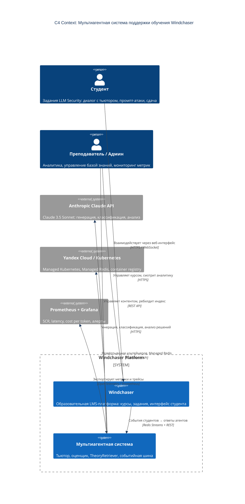

# C4 Context — Система, пользователь, внешние сервисы и границы

Диаграмма показывает систему мультиагентного обучения целиком как «чёрный ящик» в окружении людей и внешних систем.

## Пояснения

| Актор / система | Роль |
|---|---|
| **Студент** | Основной пользователь: задаёт вопросы тьютору, пробует атаки, сдаёт задания |
| **Преподаватель** | Мониторит прогресс студентов, управляет базой знаний, настраивает задания |
| **Windchaser** | LMS-платформа — источник событий и потребитель ответов агентов |
| **Мультиагентная система** | Ядро: обрабатывает события, генерирует ответы, оценивает задания |
| **Anthropic Claude API** | Внешний LLM-провайдер; единственная внешняя зависимость для интеллектуальных функций |
| **Yandex Cloud** | Инфраструктура развёртывания; Managed Redis — персистентный брокер и state store |
| **Prometheus + Grafana** | Наблюдаемость: SCR, latency, cost per call, circuit breaker state |

## Границы системы

- Всё внутри `Windchaser Platform` — под контролем команды
- Anthropic Claude API — внешняя зависимость; деградация защищена circuit breaker
- Пользовательские данные (PII) не передаются в Anthropic; промпты обезличены
