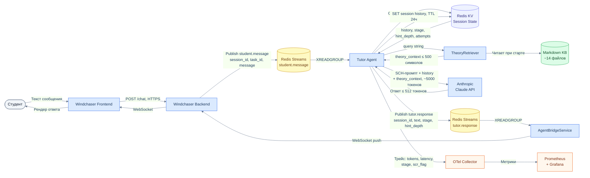
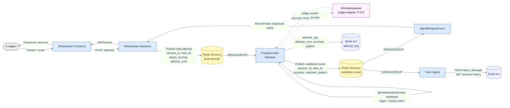
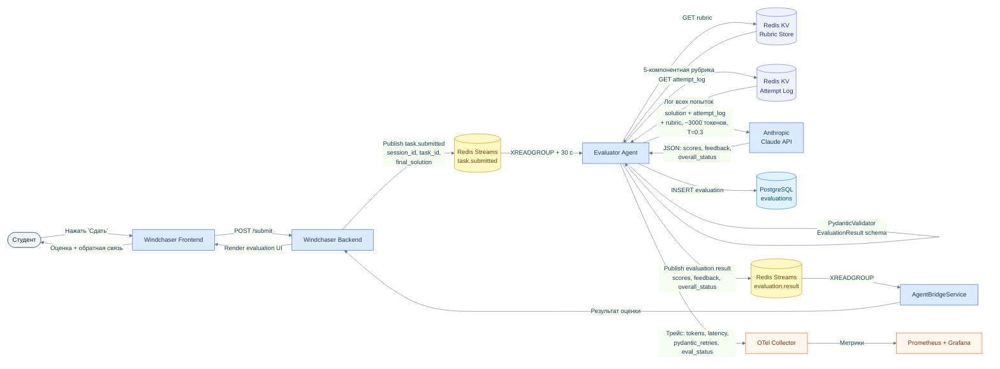
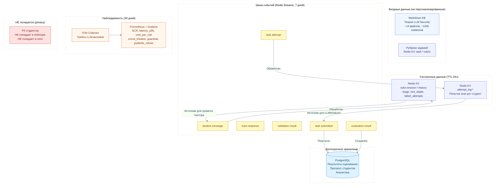

# Data Flow Diagram — Движение данных, хранение и логирование

Диаграммы показывают, как данные проходят через систему на каждом из трёх основных сценариев: что именно хранится, где и как долго; что попадает в логи и мониторинг.

---

## 1. Data flow: диалог с тьютором

### Что хранится при диалоге

| Хранилище | Ключ / таблица | Данные | TTL / Retention |
|---|---|---|---|
| Redis KV | `tutor:session:{id}:history` | history (role, content, ts), stage, hint_depth, failed_attempts, stage_transitions | 24 ч |
| Redis Streams | `student.message` | session_id, task_id, message, timestamp | до ACK + 7 дней |
| Redis Streams | `tutor.response` | session_id, text, stage, hint_depth, scr_flag | до ACK + 7 дней |
| OTel / Prometheus | метрики | input_tokens, output_tokens, latency_ms, stage, scr_value, guardrail_triggered | 30 дней |

---

## 2. Data flow: попытка атаки

### Что хранится при попытке атаки

| Хранилище | Ключ / таблица | Данные | TTL / Retention |
|---|---|---|---|
| Redis Streams | `task.attempt` | session_id, task_id, attack_prompt, attempt_num | до ACK + 7 дней |
| Redis Streams | `validation.result` | session_id, task_id, attempt_num, success, matched_pattern | до ACK + 7 дней |
| Redis KV | `attempt_log:{task_id}:{student_id}` | список попыток: attempt_num, success, pattern, latency_ms | 24 ч |
| Redis KV | `tutor:session:{id}:history` | обновлённый failed_attempts | 24 ч |

---

## 3. Data flow: финальная сдача задания

### Что хранится при сдаче задания

| Хранилище | Ключ / таблица | Данные | TTL / Retention |
|---|---|---|---|
| Redis KV | `task:{task_id}:rubric` | 5-компонентная рубрика | постоянно |
| Redis KV | `attempt_log:{task_id}:{student_id}` | лог попыток (источник для LLMAnalyzer) | 24 ч |
| Redis Streams | `task.submitted` | session_id, task_id, final_solution, dialog_log | до ACK + 7 дней |
| Redis Streams | `evaluation.result` | scores, feedback, overall_status | до ACK + 7 дней |
| **PostgreSQL** | `evaluations` | task_id, student_id, scores по критериям, feedback, overall_status, evaluation_status, created_at | постоянно |
| OTel / Prometheus | метрики | input_tokens, output_tokens, latency_ms, pydantic_retries, evaluation_status | 30 дней |

---

## 4. Сводная схема: что где хранится и логируется

## Что НЕ передаётся во внешние системы

- **PII студентов** (имена, email, ID) — не включаются в промпты для Anthropic API; промпты обезличены
- **Диалог тьютора** — не передаётся в Evaluator Agent; изоляция контекстов контролируется интеграционными тестами
- **Системные промпты (SCH)** — не раскрываются студентам и не логируются в открытом виде
- **Секреты заданий** (целевой системный промпт уязвимого LLM) — хранятся отдельно, не попадают в контекст тьютора
