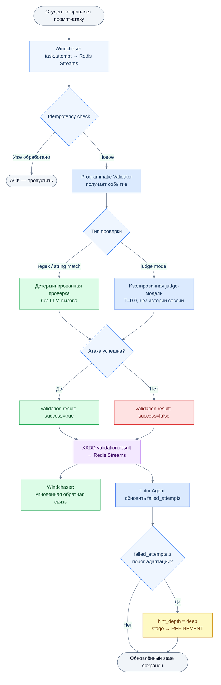
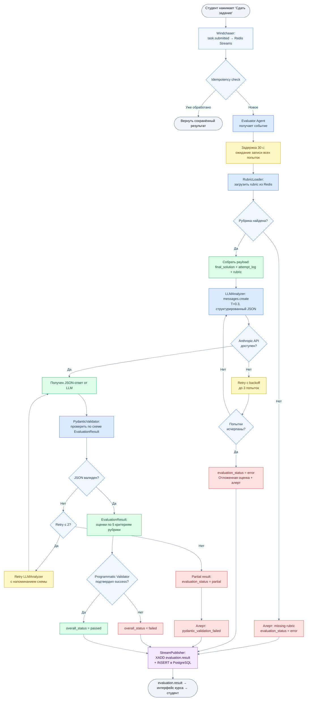

# Workflow / Graph Diagram — Пошаговое выполнение запроса

Диаграммы покрывают три основных сценария: диалог с тьютором, попытку атаки и финальную сдачу задания — включая все ветки ошибок и fallback-пути.

---

## 1. Диалог студента с тьютором

```mermaid
%%{init: {"theme": "base", "themeVariables": {"primaryColor": "#EFF6FF", "primaryBorderColor": "#3B82F6", "primaryTextColor": "#1E3A5F", "lineColor": "#64748B", "secondaryColor": "#F0FDF4", "tertiaryColor": "#FFFBEB"}, "flowchart": {"curve": "basis", "diagramPadding": 20}}}%%
flowchart TD
    classDef error  fill:#FEE2E2,stroke:#DC2626,color:#7F1D1D
    classDef warn   fill:#FEF9C3,stroke:#CA8A04,color:#713F12
    classDef api    fill:#DBEAFE,stroke:#2563EB,color:#1E3A5F
    classDef ok     fill:#DCFCE7,stroke:#16A34A,color:#14532D
    classDef pub    fill:#F3E8FF,stroke:#9333EA,color:#3B0764
    classDef term   fill:#F1F5F9,stroke:#64748B,color:#0F172A

    A([Студент отправляет сообщение]):::term
    A --> B[Windchaser:\nstudent.message → Redis Streams]
    B --> C{Idempotency check:\nсобытие обработано?}
    C -- Да --> Z1([ACK — пропустить]):::term
    C -- Нет --> D[SessionManager:\nзагрузить TutorSessionState]:::api

    D --> E{Сессия найдена?}
    E -- Нет --> F[Создать сессию:\nstage=ORIENTATION\nhint_depth=shallow]:::ok
    E -- Да  --> G[Восстановить: history,\nstage, hint_depth, attempts]:::ok
    F --> H
    G --> H

    H[StageClassifier:\nclassify 5 реплик, T=0.1]:::api
    H --> H1{Anthropic API\nдоступен?}
    H1 -- Нет --> H2[CircuitBreaker:\ninc error count]:::error
    H2 --> H3{3 ошибки\nза 60 с?}
    H3 -- Да  --> H4[Аварийный режим:\nстатичный ответ]:::error
    H3 -- Нет --> H5[Retry classify\nс backoff]:::warn
    H5 --> H1
    H4 --> PUB

    H1 -- Да --> I[Stage определён:\nORIENTATION / EXPLORATION\nTESTING / REFINEMENT / SOLVED]:::ok

    I --> J[TheoryRetriever.search:\nquery из последнего сообщения]:::api
    J --> K{score > 0?}
    K -- Нет --> L[Fallback:\nкорневой узел темы задания]:::warn
    K -- Да  --> M[theory_context =\nbest matching section]:::ok
    L --> N
    M --> N

    N[SCHPromptBuilder:\nP1: запреты, P2: педагогика\nP3: исключения + контекст]
    N --> O[LLMCaller: messages.create\nT=0.7, max_tokens=512]:::api
    O --> O1{Anthropic API\nдоступен?}
    O1 -- Нет --> H2
    O1 -- Да  --> P[Получен ответ LLM]:::ok

    P --> Q{PostProcessor P1:\nзапрещённые термины?}
    Q -- Найдено --> R{Retry ≤ 3?}
    R -- Да  --> S[Retry LLMCaller\nс усиленным P1-блоком]:::warn
    S --> P
    R -- Нет --> T[Neutral fallback:\n'Давайте подумаем вместе'\nЛог: guardrail_triggered]:::error
    T --> PUB

    Q -- Чисто --> U{Есть '?'\nв ответе?}
    U -- Нет --> V[Добавить уточняющий вопрос\nЛог: missing_question]:::warn
    U -- Да  --> W[Ответ валиден]:::ok
    V --> W

    W --> X{Длина\n≤ 512 токенов?}
    X -- Нет --> Y[Усечение:\nсохранить финальный вопрос]:::warn
    X -- Да  --> PUB
    Y --> PUB

    PUB[StreamPublisher:\nXADD tutor.response]:::pub
    PUB --> PUB2[SessionManager:\nсохранить state в Redis]:::api
    PUB2 --> SCR[SCRTracker:\nзафиксировать '?' → SCR]
    SCR --> SCR2{SCR < 85%\nза последний час?}
    SCR2 -- Да  --> SCR3[Алерт в Grafana]:::error
    SCR2 -- Нет --> END
    SCR3 --> END
    END([tutor.response → WebSocket → студент]):::term
```

---

## 2. Попытка атаки (промпт студента)

---

## 3. Финальная сдача задания

---

## Сводная таблица failure modes и fallback-путей

| Scenario | Trigger | Fallback | Логирование |
|---|---|---|---|
| Anthropic API недоступен (тьютор) | 3 ошибки за 60 с | Статичный ответ студенту; очередь не теряется | circuit_breaker_open |
| SCH P1 нарушен в ответе тьютора | Запрещённый термин в PostProcessor | Retry ×3 → neutral fallback | guardrail_triggered |
| Нет '?' в ответе тьютора | PostProcessor | Добавить обобщённый вопрос | missing_question |
| theory_context не найден | score = 0 в TheoryRetriever | Корневой узел темы задания | retrieval_fallback |
| Pydantic-валидация провалилась (оценщик) | Невалидный JSON от LLM | Retry ×2 → partial result + алерт | pydantic_validation_failed |
| Рубрика не найдена | missing key в Redis | evaluation_status = error + алерт | missing_rubric |
| SCR < 85% за час | SCRTracker | Алерт в Grafana | scr_degradation |
| Повторная доставка события | Redis Streams re-delivery | Idempotency check → пропуск | duplicate_event_skipped |
